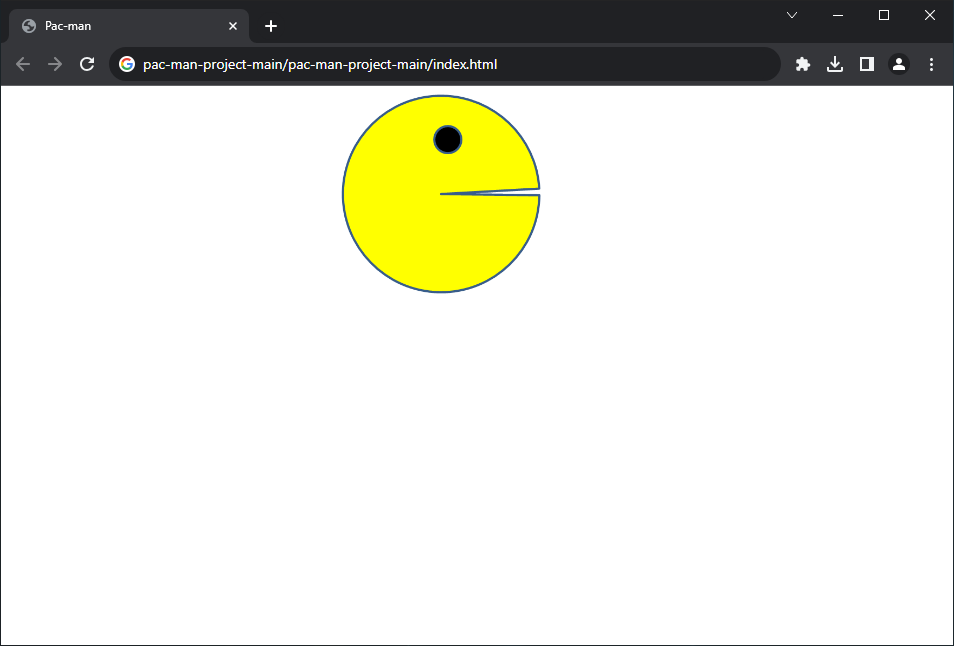

# Pac Man Project

## Description
This project is part of MIT Professional Certificate in Coding: Full Stack Development with MERN - week 7, it is a PacMan moving across the screen and reversing direction when it reach the window edge.
it builds using Javascript, HTML, and CSS.

## How to Run
Download the project and run the index.html using browser.

## Future Improvements
Add more PacMan that has diffrent CSS design.

## Support
github : thisisraghad

## License
MIT
